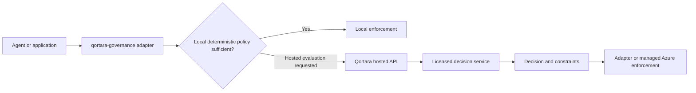

# Architecture Boundaries

## Purpose

This document defines the responsibilities of the public `qortara-governance` repository and its relationship to Qortara's licensed hosted decision service and managed Azure enforcement services.

## Public repository responsibility

`qortara-governance` is the public integration and deterministic enforcement layer.

It contains:

- framework adapters
- public request and response contracts
- local deterministic policy enforcement
- Microsoft Agent Governance Toolkit integration
- hosted-service clients
- transport and authentication helpers
- decision receipt validation
- local audit event generation
- explicit fallback and failure behavior

It does not contain Qortara's proprietary proportional-authority algorithms, internal weighting, thresholds, transition logic, or cumulative-risk procedures.

## Product layers

### Public local governance

Available through the open-source packages:

- deterministic allow and deny rules
- synchronous tool-dispatch enforcement
- local policy evaluation
- adapter integration
- local audit events
- explicit approval-required outcomes

### Qortara hosted decision service

Available through licensed Qortara plans:

- contextual authority evaluation
- cumulative and sequence-aware risk evaluation
- evidence and confidence evaluation
- impact and reversibility analysis
- adaptive escalation
- richer reason codes and constraints

### Managed Azure enforcement

Available as part of the managed platform:

- centralized tenant policy
- managed approval workflows
- enterprise identity
- durable audit evidence
- fleet-wide reporting
- monitoring and service operations
- distributed enforcement coordination

## Request and response boundary

The public SDK may send a normalized request containing:

- principal identity and type
- proposed action
- target resource and destination
- runtime context
- evidence references
- execution-history summary
- current authority class
- adapter and contract versions

The hosted service may return:

- decision
- authority class
- reason codes
- constraints
- approval requirements
- decision identifier
- receipt verification data
- contract version
- expiry or replay limits

The public contract does not expose internal decision formulas, exact weights, thresholds, or private decision procedures.

## Evaluation flow

## Capability matrix

| Capability | Public local | Hosted Qortara | Managed Azure |
|---|---:|---:|---:|
| Static policy enforcement | Yes | Yes | Yes |
| Local allow and deny rules | Yes | Yes | Yes |
| Local audit event generation | Yes | Yes | Yes |
| Contextual authority evaluation | No | Yes | Yes |
| Cumulative risk evaluation | No | Yes | Yes |
| Adaptive escalation | No | Yes | Yes |
| Managed approval workflows | No | Optional | Yes |
| Tenant-specific hosted policy | No | Yes | Yes |
| Centralized reporting | No | Optional | Yes |
| Durable enterprise audit evidence | No | Optional | Yes |

## Failure behavior

Local deterministic enforcement remains available without a hosted subscription.

When hosted evaluation is requested but unavailable, the adapter must return an explicit outcome. It must not fabricate a hosted decision or silently weaken expected enforcement.

Supported deployment policies may include:

- fail closed for protected actions
- use local deterministic policy when explicitly allowed
- return entitlement required
- return hosted service unavailable

## Versioning

Public contracts use semantic versioning.

Changes require:

- compatibility tests in public and private repositories
- migration guidance
- explicit unsupported-version errors
- stable reason-code semantics within a major version

## Public positioning

Use this description:

> `qortara-governance` provides open, deterministic governance and enforcement infrastructure. Qortara's hosted platform extends it with proprietary proportional authority evaluation and managed enterprise enforcement on Azure.

Do not describe the public package as an incomplete copy of the hosted product. It is a complete deterministic governance layer with an optional hosted decision service above it.

## Governing principle

Publish the interface. Protect the inference.
