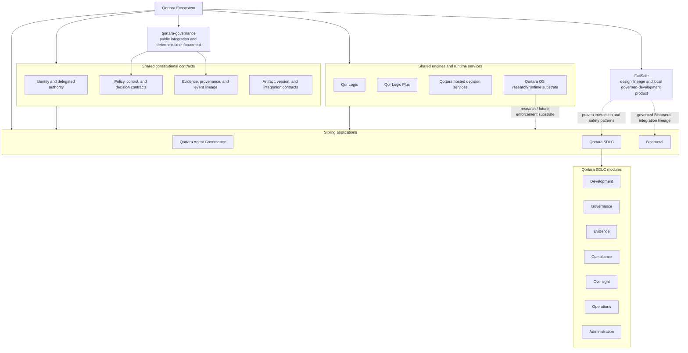

# Qortara Ecosystem Canonical Architecture

**Status:** Canonical product-family architecture proposal for review  
**Scope:** Qortara product family, Qortara SDLC, agent governance, shared decision/evidence contracts, Qor engines, Qortara OS, FailSafe design lineage, and Bicameral integration  
**Date:** 2026-09-01

## 1. Purpose

This document defines the intended shape of the Qortara ecosystem so that product boundaries, shared contracts, operator surfaces, and dark-factory capabilities can evolve without duplicating authority or turning repository names into UI navigation.

It answers five questions:

1. What products and substrates exist in the Qortara ecosystem, and what wedge does each own?
2. What is canonical inside Qortara SDLC?
3. Which capabilities should be shared rather than rebuilt by each product?
4. How should candidate operator surfaces, including Bicameral Atlas, Guidance, and Workbench concepts, graduate into Qortara SDLC?
5. What additional contracts and capabilities are required for defensible supervised autonomy and dark-factory operation?

This document does **not** transfer semantic authority away from the repository that owns a capability. Cross-product architecture is a composition contract, not permission for one repository to redefine its siblings.

## 2. Ecosystem thesis

Qortara is a family of governed agentic systems, not one monolithic application.

The common problem is increasingly autonomous software and agent execution: fast systems can produce more work, more decisions, more evidence, and more failure modes than a human can reliably supervise by watching a dashboard or reviewing prompts.

The Qortara ecosystem therefore exists to make autonomy **attributable, bounded, policy-mediated, observable, evidenced, auditable, recoverable, and progressively automatable**.

The ecosystem supports a continuum of operating modes:

```text
Human-operated
    -> AI-assisted
    -> collaborative multi-agent
    -> supervised autonomy
    -> dark factory / headless autonomy
```

These are operating modes, not separate products.

## 3. Canonical ecosystem map



### Architectural rule

**Shared contracts unify the ecosystem. They do not create a single semantic owner.**

Qortara Agent Governance and Qortara SDLC are sibling applications. Bicameral is another bounded application that can consume Qortara governance and evidence contracts while retaining its own product purpose.

## 4. Product and repository responsibility map

| Component | Canonical wedge | Must not become |
|---|---|---|
| **Qortara SDLC** | Governed software-development lifecycle control plane | A generic agent-governance replacement or a dumping ground for every useful UI |
| **Qortara Agent Governance / hosted Qortara services** | Governance of agentic actions, authority, contextual decisions, escalation, enterprise enforcement | Semantic owner of every sibling product |
| **qortara-governance** | Public integration, deterministic enforcement, normalized request/response contracts, local audit/evidence events, hosted-service clients | Proprietary decision logic or a general-purpose SDLC UI |
| **Qor Logic** | Deterministic governance and lifecycle logic consumed by products | A top-level user-facing SDLC module merely because it has a repository |
| **Qor Logic Plus** | Higher-order governed reasoning/evaluation capability consumed beneath product workflows | A duplicate application shell or alternate source of lifecycle truth |
| **Qortara OS** | Research toward a sovereign agent-native execution substrate with identity, delegation, compartments, policy mediation, audit, revocation, and rollback | A prematurely declared production runtime or mandatory substrate before evidence supports it |
| **FailSafe** | Local governed-development product and design lineage for intent gating, enforcement, evidence, modes, approvals, and visible failure behavior | The canonical Qortara SDLC product architecture |
| **Bicameral** | Structured multi-agent factory, deliberation, synthesis, execution coordination, and operator cognition | A second SDLC system of record, compliance owner, or policy authority |

## 5. Qortara SDLC canonical module model

The user-facing Qortara SDLC product has **seven modules**. Repository names such as Core Compliance or Core Oversight do not change the module names.

### Development

Owns the creation-and-delivery lifecycle: intent, specifications, work items, implementation runs, validation state, change state, and release readiness.

**Primary question:** What are we building, what state is it in, and what must happen next?

### Governance

Owns software-lifecycle policy, authority, gates, approvals, exceptions, and decision requirements.

**Primary question:** Is this action allowed, required, reviewable, or blocked, and why?

### Evidence

Owns evidence visibility and lifecycle linkage: provenance, artifacts, claims, attestations, event lineage, causal relationships, and replay/reconstruction references.

**Primary question:** What actually happened, what proves it, and can we reconstruct it?

### Compliance

Owns obligations, framework/control mappings, continuous checks, evidence sufficiency, exceptions, and audit-package readiness.

**Primary question:** Which obligations are satisfied, unsatisfied, excepted, or unproven?

### Oversight

Owns independent evaluation of behavior and outcomes, risk cases, anomalies, drift, escalation, intervention, and bounded supervisory action.

**Primary question:** Is the system behaving acceptably, and where must an independent actor intervene?

### Operations

Owns execution health and recovery: run state, queues, incidents, deployment/runtime integration, resource/budget state, recovery, pause, rollback, and resume.

**Primary question:** Is the system operating safely and effectively right now, and how do we recover when it is not?

### Administration

Owns organizational and product configuration: tenants/projects, identities, roles, integrations, secret references, retention, environment configuration, and administrative policy attachment.

**Primary question:** Who and what is configured to participate, under which boundaries?

### Boundary rule

The modules may share objects and views, but not semantic ownership:

- Governance decides what is permitted or required.
- Compliance evaluates obligations and sufficiency.
- Oversight evaluates behavior, outcomes, and intervention need.
- Evidence preserves proof and lineage.
- Operations manages runtime state and recovery.
- Development manages creation and delivery state.
- Administration manages identities, configuration, and integrations.

## 6. Shared constitutional contracts

A dark-factory-capable ecosystem cannot rely on visual consistency alone. The following contracts must be consistent across applications even when their repositories remain independent.

### 6.1 Identity and delegated authority

Every consequential action must identify:

- human, service, or agent principal;
- delegated authority source;
- scope and expiration;
- target resource/environment;
- applicable constraints;
- revocation state.

Prompt text is never authority.

### 6.2 Decision and enforcement contract

Every governed action should resolve through a normalized decision shape compatible with the existing qortara-governance boundary:

```text
allow | deny | require_approval | exempt
```

A decision includes stable reason codes, policy/control references, constraints, decision identity, contract version, and replay/expiry rules where applicable.

Deterministic local enforcement, hosted contextual evaluation, and managed enterprise enforcement remain distinct deployment layers.

### 6.3 Evidence and provenance contract

A canonical cross-product event/evidence envelope should minimally carry:

```text
actor_id / agent_id
principal_type
authority_scope / delegation_ref
objective_id / work_item_id / run_id
parent_event_id / causal_ids
input_artifact_hashes
model / tool / prompt / config versions
policy / control-set versions
decision_id / gate_result
output_artifact_hashes
evidence_refs
risk / exception refs
timestamp / sequence
signature / attestation
```

Products may extend this envelope. They should not invent incompatible substitutes for the common fields.

### 6.4 Artifact and version identity

Code, generated artifacts, prompts, policies, models, tools, configurations, evaluation definitions, and release candidates must be referencable by immutable version or digest where practical.

Without this, replay becomes storytelling.

## 7. Qor Logic and Qor Logic Plus

Qor Logic and Qor Logic Plus belong **beneath** the product surfaces as reusable governed reasoning and evaluation engines.

They should expose contracts that products can call rather than requiring each UI to reproduce lifecycle logic.

The critical distinction is:

```text
Product module = operator job and semantic responsibility
Engine = reusable computation used to fulfill that responsibility
```

A repository is not automatically a product module. Navigation should follow user jobs, not the organizational history of the codebase.

## 8. FailSafe design lineage

FailSafe demonstrates several patterns that should survive into Qortara even where its exact UI does not.

Repository-proven lineage includes intent-gated mutation, deterministic policy enforcement, approval routing, risk grading, audit/evidence records, explicit governance modes, headless-agent governance, visible failure behavior, and separation between system awareness and system control.

The Qortara-level design principles are:

1. **Fail visibly, never silently.** An unavailable decision service or malformed verdict cannot quietly become permission.
2. **Fail closed for protected actions.** Unverifiable authority, policy, or scope denies by default.
3. **Separate awareness from control.** Monitoring surfaces optimize recognition; control surfaces optimize deliberate action.
4. **Make intervention first-class.** Pause, kill, rollback, retry, replay, approve, deny, and resume are modeled actions, not improvised escape hatches.
5. **Preserve chain of custody through recovery.** Remediation must not erase the evidence of the failure that caused it.
6. **Expose provenance and uncertainty.** A confident-looking UI must not conceal incomplete evidence or inferred state.
7. **Contain blast radius.** Scope, budgets, quotas, compartments, and circuit breakers bound damage.
8. **Do not allow the executor to certify itself.** Consequential verification needs an independent evaluator or independently governed evidence path.

FailSafe surfaces should be evaluated against the same graduation rules as Bicameral surfaces. Design lineage grants no automatic UI inheritance.

## 9. Bicameral's ecosystem wedge

Bicameral is a **specialized governed multi-agent factory and operator environment**.

Its distinctive value is not generic governance. Its value is making complex agent work legible and governable through structured deliberation, competing or complementary roles, synthesis, execution coordination, and operator cognition.

Atlas, Guidance, and Workbench are therefore best treated as **candidate Bicameral operator surface families**, not as permanent Qortara architecture terms.

A surface can pass Bicameral's evaluation and remain Bicameral-only. A useful screen does not acquire citizenship in Qortara SDLC merely because people like it.

### Bicameral must consume Qortara where Qortara owns the concern

Bicameral should:

- request policy/authority decisions through canonical governance contracts;
- emit run, decision, tool, model, artifact, and outcome evidence through canonical evidence contracts;
- reference SDLC work/release identities rather than duplicating them;
- expose independent oversight signals rather than marking its own work complete by assertion;
- support headless execution for every factory-critical action;
- preserve Bicameral-specific deliberation and coordination semantics inside Bicameral.

### Candidate Bicameral surface roles

The names may evolve, but the useful jobs are approximately:

- **Atlas:** situational model, system topology, state, evidence-backed understanding, and navigation across complex work.
- **Guidance:** recommendations, constraints, next-best actions, competing interpretations, and rationale.
- **Workbench:** bounded execution, intervention, comparison, approval, synthesis, and operator action.

No candidate graduates based on the label. It graduates based on demonstrated operator value and architectural fit.

## 10. Surface graduation doctrine

The existing **22-point multi-question grading rubric** is the authoritative product-value/usability evaluation for candidate surfaces. Its exact questions and scoring must be incorporated verbatim from its canonical source. This document intentionally does not recreate or rename those questions from memory.

The 22-point rubric answers:

> **Is this surface valuable, understandable, defensible, and worthy of continued product investment?**

That is necessary but insufficient.

A second set of non-scoreable **architecture gates** answers:

> **Is this surface allowed to live in this product and module without violating system boundaries?**

A high rubric score cannot override a failed architecture gate.

### Required architecture gates

A surface cannot graduate into Qortara SDLC unless all applicable gates pass:

1. **Bounded owner:** The target product and module have clear semantic responsibility for the job.
2. **Consequential job:** The surface supports a real operator decision, action, understanding, or recovery need.
3. **System of record:** Authoritative data sources are named.
4. **Evidence contract:** The surface consumes and/or emits canonical evidence where consequential.
5. **Authority path:** Governed actions use the canonical policy/authority decision path.
6. **Headless parity:** Factory-critical actions have equivalent API/command capability.
7. **Failure semantics:** unavailable, stale, partial, denied, degraded, and conflicting states are explicit.
8. **No duplicated truth:** The surface does not create another repository's source of truth.
9. **Replayability:** consequential decisions and mutations are reconstructable from evidence.
10. **Measured value:** instrumentation identifies whether the surface improves the intended outcome.

### Graduation lifecycle

```text
Candidate
  -> 22-point evaluation
  -> architecture-gate evaluation
  -> prototype
  -> instrumented trial
  -> decision:
       graduate to target product/module
       remain Bicameral-specific
       remain FailSafe-specific
       defer
       reject / remove
```

### Surface registry

Every evaluated surface should have one machine-readable registry record containing:

```yaml
surface_id:
name:
source_product:
source_family: # Atlas / Guidance / Workbench / SDLC / FailSafe / other
target_product:
target_module:
job_to_be_done:
primary_decision_or_action:
authoritative_data_sources: []
evidence_reads: []
evidence_writes: []
authority_policy_path:
headless_equivalent:
rubric_version:
rubric_answers_ref:
rubric_score:
architecture_gates: {}
success_metrics: []
graduation_state:
owner:
rollback_or_removal_criteria: []
```

The raw rubric answers matter as much as the score. A single number without evidence merely industrializes vibes.

## 11. Recommended Qortara SDLC surface classes

These are **candidate surface classes**, not mandatory page names. Each must still pass the 22-point rubric and architecture gates.

| Module | Minimum high-value surface classes |
|---|---|
| Development | Work Graph; Run Detail; Release Readiness |
| Governance | Decision/Gate Queue; Policy Explorer; Exception Detail |
| Evidence | Evidence Ledger; Provenance Graph; Artifact/Attestation Detail |
| Compliance | Control Posture; Evidence Gaps; Audit Package |
| Oversight | Intervention Queue; Risk Case; Behavior/Evaluation Detail |
| Operations | Run Queue; Incident & Recovery; Budget/Resource Health |
| Administration | Identities & Authority; Integrations; Retention & Configuration |

### Global experience rule

The product home and persistent context should answer, with as little interpretation as possible:

- What is happening now?
- What is blocked?
- What is allowed or denied, and why?
- What evidence is present or missing?
- What risk or exception requires attention?
- What action can I take?
- What happens if nobody acts?

A dashboard that cannot answer these is decoration with database access.

## 12. Dark-factory requirements

Dark-factory operation is not achieved by hiding the UI. It requires the same controls to remain effective when no human is continuously watching.

Required capabilities include:

- workload and agent identity;
- scoped delegated authority;
- policy decision points and enforcement points;
- append-only run/decision/evidence lineage;
- versioned model/tool/prompt/config/code/policy/control identities;
- deterministic reconstruction and replay support;
- continuous evaluation and verification evidence;
- budgets, quotas, time limits, and circuit breakers;
- release authorization and attestations;
- anomaly, drift, and risk detection;
- incident, pause, kill, rollback, and resume operations;
- artifact, dependency, and SBOM lineage where applicable;
- break-glass human override with explicit evidence;
- retention, redaction, classification, and privacy contracts;
- independent verification separated from execution;
- governed external tool/action provenance;
- cost, time, and resource governance;
- zero-UI operational parity.

### Critical invariant

**Every factory-critical UI action must have a governed headless equivalent.**

If an autonomous factory still requires a human to click a hidden button to recover, approve, verify, or release, it is not autonomous. It is a manual system wearing a trench coat.

## 13. Capability tiers

A useful prioritization model is:

### Tier 0: Constitutional substrate

Identity, authority, delegation, policy, decisions, evidence, provenance, event lineage, immutable version identity, and integration contracts.

These are non-negotiable dependencies for consequential autonomy.

### Tier 1: Lifecycle and control capabilities

Development state, verification, compliance, oversight, operations, release controls, incident/recovery, and administrative control.

These make the system governable in practice.

### Tier 2: Operator acceleration

Bicameral deliberation, guidance, synthesis, comparison, intelligent navigation, and cognitive assistance.

These make complex work faster and more comprehensible.

### Tier 3: Visualization and convenience

Secondary dashboards, alternate visualizations, summaries, and ergonomic enhancements.

Tier 2 and Tier 3 experiences may improve cognition dramatically. They may never bypass Tier 0 or Tier 1 controls.

## 14. Required-but-not-yet-proven unified contracts

The following are architecture requirements whose complete cross-product implementation should be verified rather than assumed:

1. **Cross-product identity, authority, and delegation contract.**
2. **Shared objective/work/run/decision namespace and causal event envelope.**
3. **Evidence/provenance schema usable by Qortara SDLC, Bicameral, and Agent Governance.**
4. **Explicit integration contract between Qor Logic / Qor Logic Plus and product decision points.**
5. **Canonical surface registry containing the 22-point evaluation evidence and graduation state.**
6. **Headless-parity contract for every dark-factory-critical action.**
7. **Intervention and recovery contract spanning Oversight and Operations.**
8. **Verification-independence and separation-of-duties model.**
9. **Versioned cross-product event/integration API.**
10. **Product-family semantic-authority registry to prevent documentation and implementation drift.**

These items are labeled **required/unverified**, not presumed absent.

## 15. Semantic authority registry

The ecosystem should maintain a small canonical registry that answers, for every important object or decision, which repository/product owns its semantics.

Example categories:

| Concern | Semantic owner class |
|---|---|
| SDLC work/release lifecycle | Qortara SDLC owning module |
| Agent action governance contract | qortara-governance / hosted governance contract as applicable |
| Compliance obligation/control state | Qortara SDLC Compliance |
| Behavioral intervention case | Qortara SDLC Oversight |
| Evidence/provenance presentation and lifecycle linkage | Qortara SDLC Evidence, using shared evidence contracts |
| Bicameral deliberation/synthesis model | Bicameral |
| Qor evaluation algorithms | Qor Logic / Qor Logic Plus owning repository |
| OS-level sovereign execution primitives | Qortara OS |

The registry should name the owning repository, contract/schema, version policy, and allowed consumers.

## 16. Recommended implementation sequence

### Phase 0: Freeze the map

- Adopt this product-family topology.
- Confirm repository and semantic owners.
- Resolve naming drift.
- Import the exact 22-point rubric into a canonical versioned artifact.

### Phase 1: Lock Tier 0 contracts

- identity/delegation;
- normalized policy/decision contract;
- evidence/provenance event envelope;
- artifact/version identity;
- cross-product identifiers and causal linkage.

### Phase 2: Establish headless control parity

Define APIs/commands for consequential Development, Governance, Evidence, Compliance, Oversight, Operations, and Administration actions before relying on UI-only flows.

### Phase 3: Run the surface graduation program

Evaluate existing Qortara, FailSafe, and Bicameral Mock UI candidates using:

1. the exact 22-point rubric;
2. architecture gates;
3. instrumented user/outcome evidence.

Graduate only the smallest defensible set of surfaces.

### Phase 4: Bind Bicameral to shared contracts

Use adapters and shared identifiers so Bicameral can accelerate work without becoming a duplicate source of policy, lifecycle, or evidence truth.

### Phase 5: Automate closed-loop governance

Connect compliance, oversight, release, intervention, and recovery flows so evidence can trigger governed action without continuous human orchestration.

### Phase 6: Prove dark-factory operation

Run bounded autonomous workloads with:

- no required UI interaction;
- enforced authority and budgets;
- independent verification;
- complete replayable evidence;
- tested pause/kill/rollback/recovery;
- explicit human break-glass authority.

Only after this proof should “dark factory” be treated as a delivered capability rather than a product aspiration.

## 17. Definition of done for the ecosystem architecture

The architecture is operationally canonical when the ecosystem has:

- one responsibility and semantic-authority map;
- one shared identity/delegation contract;
- one cross-product evidence/event envelope;
- one normalized decision/gate contract;
- one run/work/causality model;
- one versioned integration contract;
- one surface registry with raw 22-point answers, score, target owner, source of truth, headless equivalent, architecture gates, and graduation state;
- one gap/roadmap ledger;
- one naming/glossary source;
- conformance tests proving that sibling applications can interoperate without transferring semantic ownership.

## 18. Canonical decisions captured here

1. Qortara is a product ecosystem, not a monolith.
2. Qortara Agent Governance and Qortara SDLC are sibling applications.
3. Qortara SDLC contains seven user-facing modules: Development, Governance, Evidence, Compliance, Oversight, Operations, and Administration.
4. Qor Logic and Qor Logic Plus are shared engines beneath product workflows, not additional SDLC navigation modules.
5. Bicameral is a bounded multi-agent factory/operator application in the ecosystem, not a replacement for Qortara SDLC.
6. Atlas, Guidance, and Workbench are candidate experience families whose individual surfaces must earn graduation.
7. The existing 22-point rubric is authoritative for product-surface evaluation and must be preserved verbatim.
8. Architecture gates can veto graduation even when a surface scores highly.
9. FailSafe contributes proven design lineage and patterns, not automatic UI inheritance.
10. Dark-factory capability requires governed headless parity, independent verification, evidence, intervention, and recovery.
11. Shared contracts create interoperability, not a mega-owner.
12. Semantic authority remains with the repository/product that owns the concern.

## Related canonical material

- [`ARCHITECTURE-BOUNDARIES.md`](./ARCHITECTURE-BOUNDARIES.md) for public deterministic enforcement, hosted decision services, and managed Azure boundaries.
- [`ARCHITECTURE_PLAN.md`](./ARCHITECTURE_PLAN.md) for the current qortara-governance implementation architecture and AGT foundation.
- Qortara SDLC `PRODUCT_MODULES.md` for the seven-module product model.
- Qortara SDLC operator-experience doctrine and review checklist for product-surface quality constraints.
- Qortara OS repository for sovereign runtime research and substrate decisions.
- FailSafe repository for local governed-development product behavior and design lineage.
- Bicameral Factory `mock-ui` branch for current candidate surface experimentation and graduation evidence.

---

**Governing principle:** Qortara should make increasingly autonomous work safer by making authority explicit, action enforceable, evidence durable, outcomes independently evaluable, and recovery possible. A surface exists only when it improves that system enough to justify its complexity.