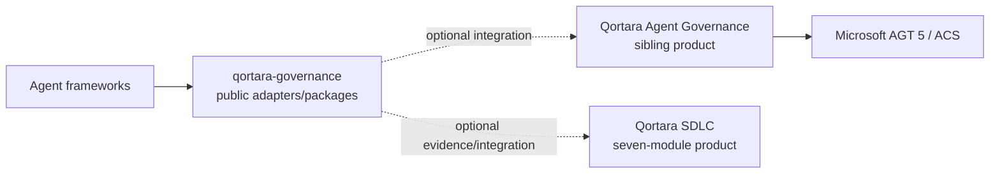

# qortara-governance Ecosystem Position

## Role

`MythologIQ-Labs-LLC/qortara-governance` is the public adapter/package workspace for Qortara agent-governance framework integrations and enforcement contracts.

It is intentionally narrower than either primary Qortara product.

## Product boundary

This repository is **not**:

- the **Qortara Agent Governance** hosted product;
- the **Governance** module inside Qortara SDLC;
- the authority for Qortara SDLC's product taxonomy;
- the authority for shared Qortara account, subscription, billing, or entitlement state.

The repository's package dependencies and compatibility line describe this public workspace only. They must not be used as a proxy for the current hosted Qortara Agent Governance architecture.

The hosted Agent Governance product currently aligns its execution boundary to Microsoft Agent Governance Toolkit 5 / Agent Control Specification (ACS). This public workspace remains separately versioned and may require explicit modernization before it reaches that same dependency line.

## Position

The arrows describe integration. They do not transfer product or semantic authority.

## Qortara SDLC relationship

Qortara SDLC owns its own software-development/delivery product composition. Its canonical seven modules are:

1. Development
2. Governance
3. Evidence
4. Compliance
5. Oversight
6. Operations
7. Administration

`Now` is an attention/orientation surface, not an eighth module.

The **Governance** label above is a Qortara SDLC module. It does not refer to this repository.

Likewise, **Qor Compliance** and **Qor Oversight** are backing repository/component names for the SDLC **Compliance** and **Oversight** modules. Repository names do not define the product taxonomy.

The authoritative taxonomy lives in `MythologIQ-Labs-LLC/qortara-sdlc/PRODUCT_MODULES.md` and `registry/qortara-sdlc.modules.json`.

## Owns

Within its declared public package boundary, this repository owns:

- public framework-adapter code shipped from this workspace;
- public enforcement request/response contracts exposed by these packages;
- package-level compatibility and integration behavior;
- package documentation, tests, release metadata, and security posture;
- explicit integration seams to supported agent frameworks.

## Does not own

- Qortara Agent Governance product identity or hosted-product architecture;
- Qortara SDLC lifecycle, application composition, or module taxonomy;
- organization-scale Qor-logic-plus semantics;
- Qor-logic repository-lifecycle doctrine;
- QOR Agent harness semantics;
- account/commercial authority;
- external framework or Microsoft AGT/ACS standards.

## Current modernization boundary

The public workspace must state its actual dependency state rather than implying current hosted-product parity.

Any migration from the repository's legacy AGT dependency line to current AGT/ACS should be treated as an explicit compatibility/security modernization with tests and evidence. It must not be achieved by suppressing dependency-audit findings or weakening repository gates.

## Consumer rule

Consumers may rely only on behavior supported by the package version they actually install.

A shared name, common protocol, or compatible conceptual model does not prove that:

- the public adapter and hosted product use the same runtime version;
- a capability is production-deployed;
- a package is the SDLC Governance module;
- a Microsoft or third-party integration exists beyond the documented contract.

## Public disclosure

This is a public repository. Documentation must describe public package truth and approved product relationships without exposing private hosted topology, internal credentials, unreleased commercial configuration, or unsupported production claims.
