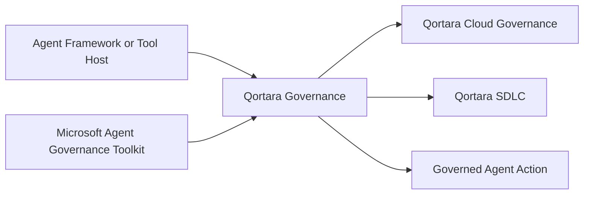

# Qortara Governance Ecosystem Position

## Role

Qortara Governance is the public framework-adapter and enforcement-contract layer for integrating agent runtimes and tool-dispatch paths with Qortara-compatible governance.

It is not a complete governance platform and must not duplicate capabilities already supplied by Microsoft Agent Governance Toolkit without a documented compatibility or extension reason.

## Position

The arrows represent adapter, enforcement, and service-contract relationships. Qortara Governance does not become the semantic owner of every upstream capability it exposes.

## Owns

- public request, response, context, event, and adapter contracts;
- framework-specific interception at declared tool and action boundaries;
- package compatibility and release behavior;
- local policy-engine integration where explicitly supported;
- optional connection to hosted or local decision services;
- fail-visible initialization and compatibility behavior;
- public conformance fixtures for supported frameworks.

## Consumes

- Microsoft AGT public packages, contracts, and extension points;
- supported framework and agent-runtime APIs;
- optional Qortara Cloud Governance service contracts;
- declared Qortara SDLC integration contracts;
- local application context supplied by the host.

## Produces

- normalized enforcement requests and responses;
- adapter events and receipts;
- compatibility and health metadata;
- framework-specific interception behavior;
- optional local or hosted governance-service calls.

## Does not own

- the complete Qortara SDLC journey;
- repository-local lifecycle semantics owned by Qor-logic;
- organization actors, claims, admission, obligations, or release sequencing owned by Qor-logic-plus;
- hosted tenant, billing, entitlement, fleet, or incident truth;
- compliance conclusions;
- proprietary claims over AGT capabilities;
- confidential-computing or independent attestation standards.

## AGT compatibility rule

AGT is a substantial upstream foundation with action governance, software-development governance, policy, identity, trust, audit, sandboxing, lifecycle, SRE, compliance, coding-agent integrations, and memory-protection work.

Before Qortara Governance implements a capability, it must classify the corresponding AGT surface as:

- stable or public preview;
- experimental;
- example-only;
- deprecated compatibility surface;
- roadmap.

Qortara Governance should wrap, adapt, extend, or contribute upstream where appropriate. It should not reconstruct AGT under a different namespace merely to produce the illusion of differentiation.

## Immediate path forward

1. Complete the repository-level AGT capability and maturity analysis.
2. Define the minimal public enforcement request, response, context, event, and error contracts.
3. Document supported AGT and framework version ranges.
4. Implement strict startup validation and explicit degraded states.
5. Publish conformance fixtures for every supported adapter.
6. Define the boundary between local enforcement and Qortara Cloud Governance services.
7. Implement the minimum adapter path required by the first Qortara SDLC vertical slice.

## Public disclosure boundary

This document describes public architecture and compatibility. It does not expose proprietary hosted algorithms, private tenant topology, private product-transition plans, or unreleased commercial behavior.